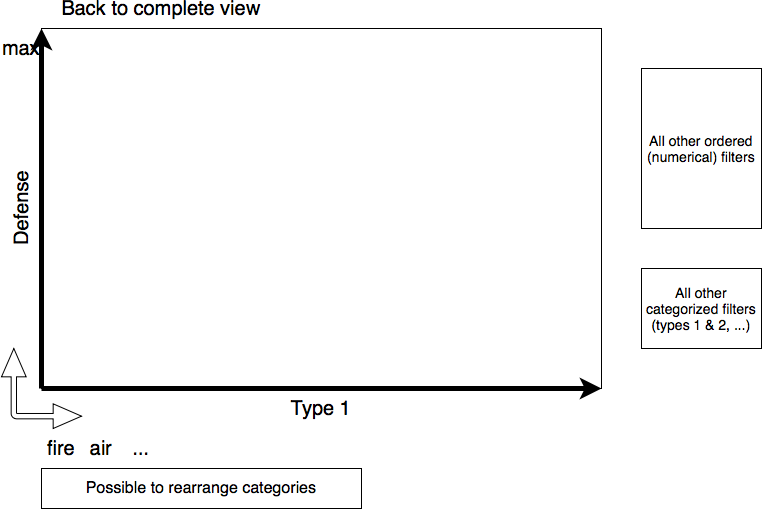
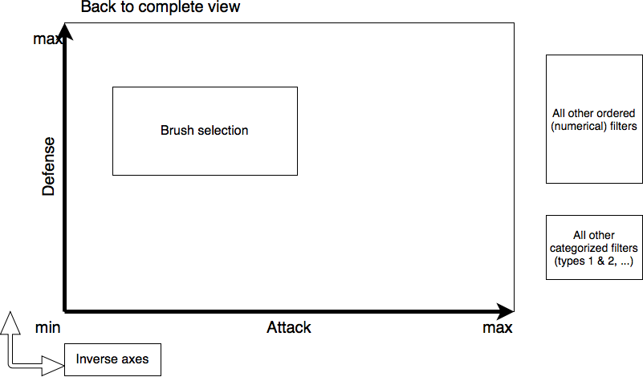
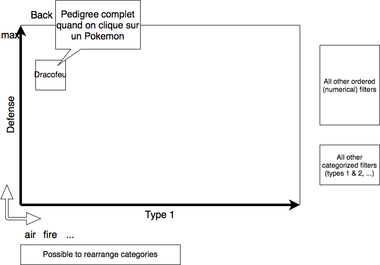
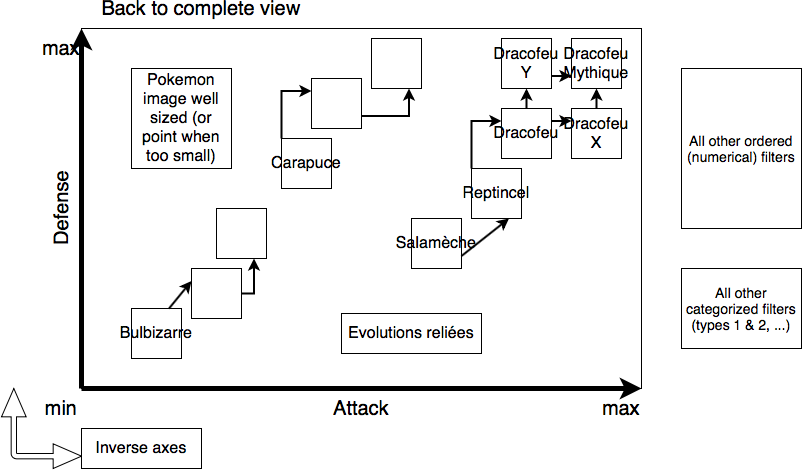

# Milestone 2 (Friday 1st May, 5pm)
**10% of the final grade**

## Project goal
We are most interested in the links between the different Types, and how they influence each other. Influence of the types vs. the statistics, and analysis to answer the big "best starter" question (i.e. "Which is the best Pokémon to choose to start the game") will be a lot of fun as well.

Our approach will attempt to interactively showcase Pokémon statistics, on the assumption that it will not be viewed by leading data scientists, but rather by ordinary people who want to discover the mathematical world of Pokémon. It is important to us to make this data accessible and understandable to as many people as possible.

## Implementation
Our minimum viable product will consist of two parts. The left-hand part will allow you to view Pokémon as dots first, on a two-dimensional plane; two default axes will be used to classify the dots, while the dots will have a color corresponding to a "third axis". We thought we'd use attack and defense as the default axes, as well as the main type for colors. The right-hand part will consist of controls for configuring the corresponding axes. It will be separated into numerical parameters where it will be possible to select a minimum or maximum value and a section for types in the form of check boxes. The user will be able to define which parameters will go in which axes, i.e. to recall two axes and a color gradient.

For a more advanced visualization, we would like to add a ["zoom" system](https://observablehq.com/@d3/smooth-zooming) by [brush selection](https://observablehq.com/@d3/brushable-scatterplot-matrix). The user will be able to select an area of points, which will be zoomed to view the corresponding Pokémon. A "unzoom" button will be made visible to return to the full view. We also provide a button to effectively reverse the view.

The next important step would be to access the complete Pokémon file. The user will be able to click on one of the Pokémon, and a [popup](https://observablehq.com/@pbogden/openlayers-popup) will appear with the Pokémon's features, along with a link to the various online resources.

Next, we want to show the links between different Pokémon and their different evolutions/characteristics. Taking the example of Charizard, we can [link it](https://observablehq.com/@chitacan/screen-picker-with-links) to its evolutions (Charizard evolves from Charmeleon, itself evolving from Charmander) as well as to its forms (Charizard is available in normal, Mega X, Mega Y and Gigantamax forms). This can be done via arrows on the normal and zoomed views, as well as the possibility to "group" by evolutions/forms.

Finally, we have the idea of being able to make a "selection" of Pokémon, just like online shopping sites that allow you to compare products. The user, via Ctrl+Click, will be able to compare different Pokémon with each other, effectively allowing roosters to be made for future games.

## Tools needed
Among the tools that we are going to realize, we are going to search particularly on the side of [D3.js](https://d3js.org/), which will allow us to exploit the data efficiently and with nice animations. Concerning the infrastructure of the site itself, we will use [Bootstrap](https://getbootstrap.com/) and [Font Awesome](fontawesome.com/), two very interesting APIs to make beautiful sites quickly.

## Functional project
You can find the functional project mockup [here](./www/milestone-2/).